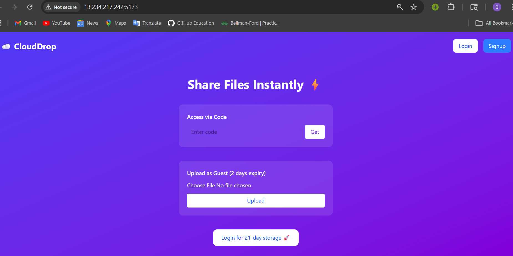
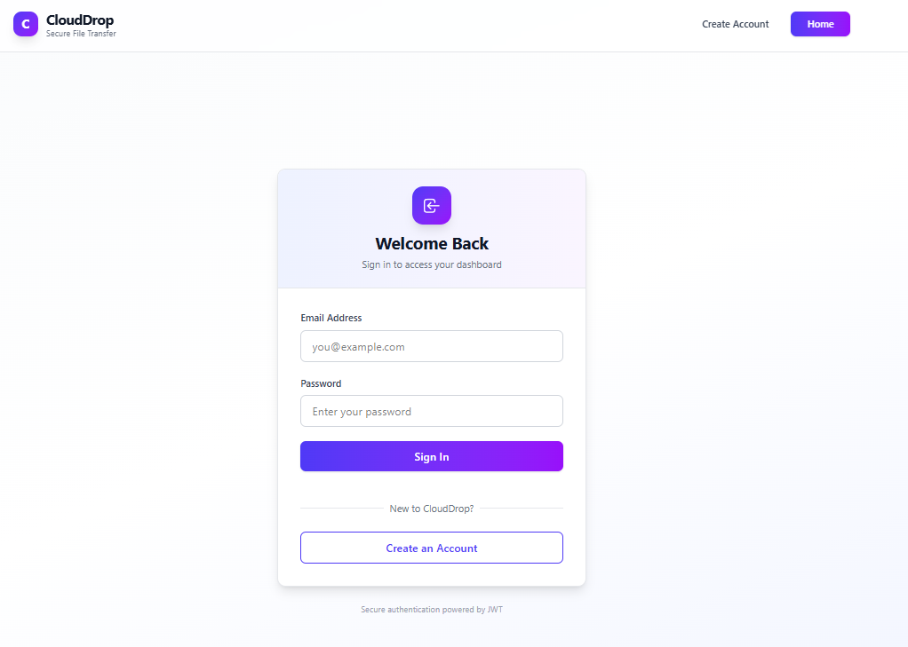
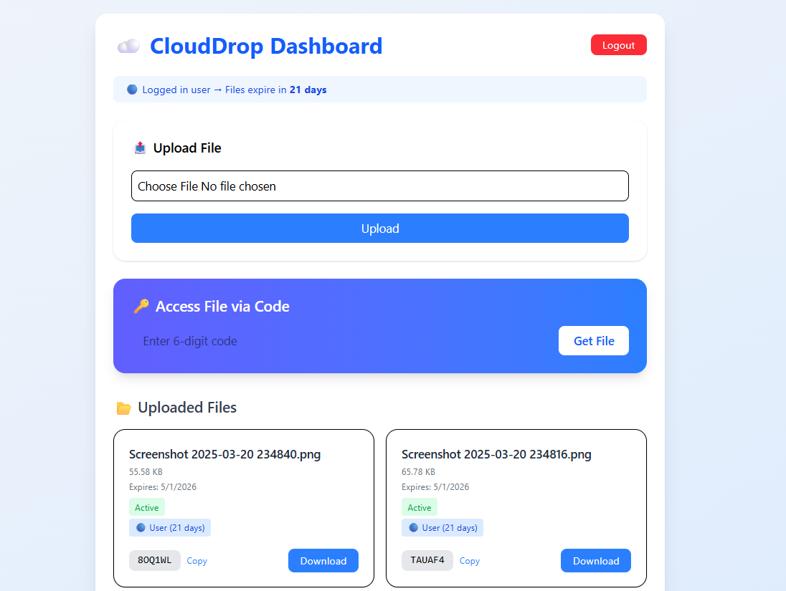
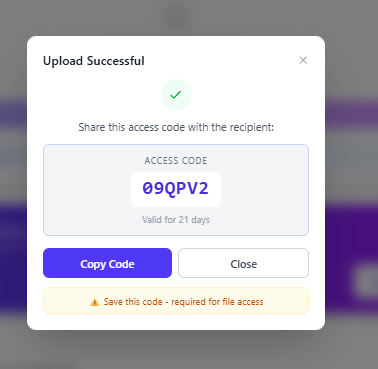

# 📦 CloudDrop – File Upload & Sharing Platform

<p align="center">
  
</p>

<p align="center">
  🚀 Cloud File Sharing Platform | MERN + AWS + Docker + CI/CD
</p>

---

## 🌐 Live Demo

👉 http://13.234.217.242:5173

---

## 📌 Features

### 👤 User Types

* **Guest Users**

  * Upload files without login
  * Get 6-digit unique access code
  * File expiry: 2 days

* **Authenticated Users**

  * Login / Signup (JWT)
  * Upload & manage files
  * File expiry: 21 days
  * Dashboard access

---

### 📂 File Handling

* Upload files using Multer
* Store files in AWS S3
* Generate pre-signed download URLs
* Track downloads
* Access via unique 6-digit code

---

### 🔐 Security & Logic

* JWT-based authentication
* Protected routes
* Expiry-based file lifecycle
* Cron job for auto-deletion of expired files (MongoDB + S3)

---

### 🎨 Frontend

* Landing page (guest upload + access)
* Login / Signup pages
* User dashboard
* Upload modal with:

  * File code display
  * Copy button
* File listing UI

---

### 🐳 DevOps & Deployment

* Dockerized frontend, backend, and MongoDB
* Docker Compose orchestration
* CI/CD pipeline using GitHub Actions
* Auto deployment to AWS EC2
* Dynamic Docker image tagging using commit SHA

---

## 🧱 Tech Stack

### 🔹 Frontend

* React.js
* Axios
* Tailwind CSS

### 🔹 Backend

* Node.js
* Express.js
* MongoDB (Mongoose)
* Multer

### 🔹 Cloud

* AWS S3

### 🔹 DevOps

* Docker
* Docker Compose
* GitHub Actions (CI/CD)
* AWS EC2

### 🔹 Infrastructure

* Terraform (EC2, S3, Security Groups)

---

## 📁 Project Structure

### Backend

```
backend/
├── config/
│   ├── db.js
│   ├── s3.js
├── controllers/
│   ├── authController.js
│   ├── fileController.js
├── middlewares/
│   ├── authMiddleware.js
│   ├── multer.middleware.js
│   ├── errorMiddleware.js
├── models/
│   ├── User.js
│   ├── File.js
├── routes/
│   ├── authRoutes.js
│   ├── fileRoutes.js
├── utils/
│   ├── asyncHandler.js
│   ├── ApiError.js
│   ├── ApiResponse.js
│   ├── generateCode.js
├── app.js
├── server.js
```

---

### Frontend

```
frontend/
├── src/
│   ├── components/
│   │   ├── Upload.jsx
│   │   ├── FileList.jsx
│   ├── pages/
│   │   ├── Landing.jsx
│   │   ├── Login.jsx
│   │   ├── Signup.jsx
│   ├── utils/
│   │   ├── api.js
│   ├── App.jsx
│   ├── main.jsx
```

---

## ⚙️ Environment Variables

### Backend (.env / .env.docker)

```
PORT=5000
MONGO_URI=your_mongodb_uri
JWT_SECRET=your_secret

AWS_REGION=ap-south-1
S3_BUCKET_NAME=your_bucket_name

AWS_ACCESS_KEY_ID=your_key
AWS_SECRET_ACCESS_KEY=your_secret
```

---

## 🐳 Docker Setup

### Run Application

```
docker compose up --build
```

### Services

* Frontend → http://localhost:5173
* Backend → http://localhost:5000

---

## 🚀 CI/CD Pipeline

Triggered on push to `main`.

### Steps:

1. Checkout code
2. Login to Docker Hub
3. Build Docker images
4. Push images with commit SHA
5. SSH into EC2
6. Pull latest images
7. Restart containers

---

## ☁️ Terraform Infrastructure

### Resources

* EC2 Instance
* Security Group
* S3 Bucket

### Commands

```
terraform init
terraform plan
terraform apply
```

---

## 🔄 System Flow

1. User uploads file
2. Backend stores metadata in MongoDB
3. File uploaded to S3
4. Unique 6-digit code generated
5. File accessed using code
6. Cron job deletes expired files

---

## 📊 Project Phases

| Phase                | Status |
| -------------------- | ------ |
| Core MERN App        | ✅      |
| AWS S3 Integration   | ✅      |
| Auth + Code + Expiry | ✅      |
| Cron Job             | ✅      |
| Advanced Upload      | ❌      |
| Docker               | ✅      |
| CI/CD                | ✅      |
| Terraform            | ✅      |

---

## 📸 Screenshots

### 🏠 Landing Page



### 🔐 Login



### 📊 Dashboard



### ⬆️ Upload



### 📂 Files


---

## 🔥 Future Enhancements

* Chunked uploads
* Resumable uploads
* Upload progress bar
* Nginx reverse proxy
* HTTPS (SSL)
* Custom domain
* IAM role-based AWS access

---

## 🔒 Security Improvements

* Use IAM roles instead of access keys
* Store secrets in environment variables
* Avoid hardcoding credentials

---

## 🧠 Key Learnings

* MERN stack development
* AWS S3 integration
* Authentication systems
* CI/CD pipelines
* Docker containerization
* Terraform (IaC)

---

## 👨‍💻 Author

**Balu Patil**

---

## ⭐ Acknowledgement

Inspired by:

* WeTransfer
* Google Drive
