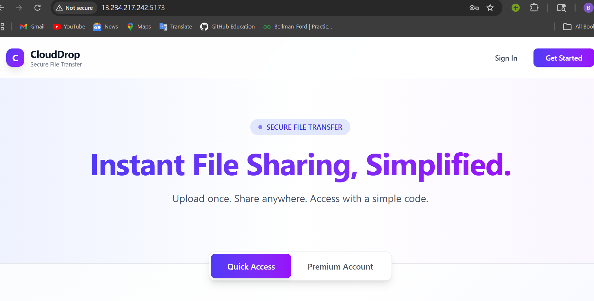
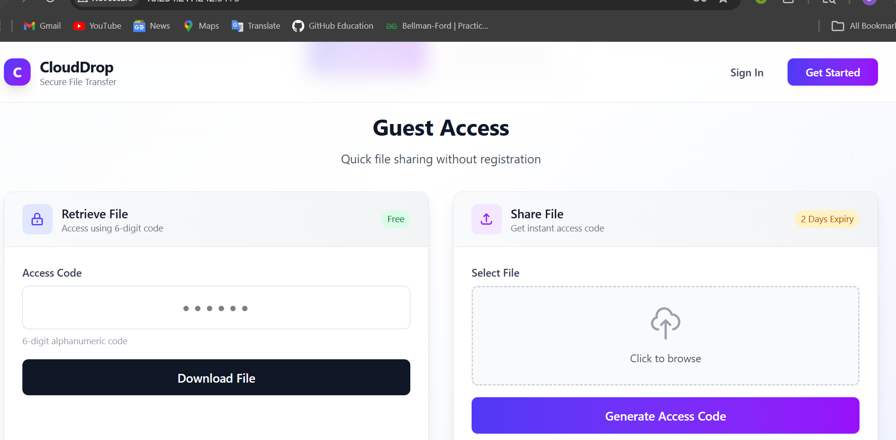
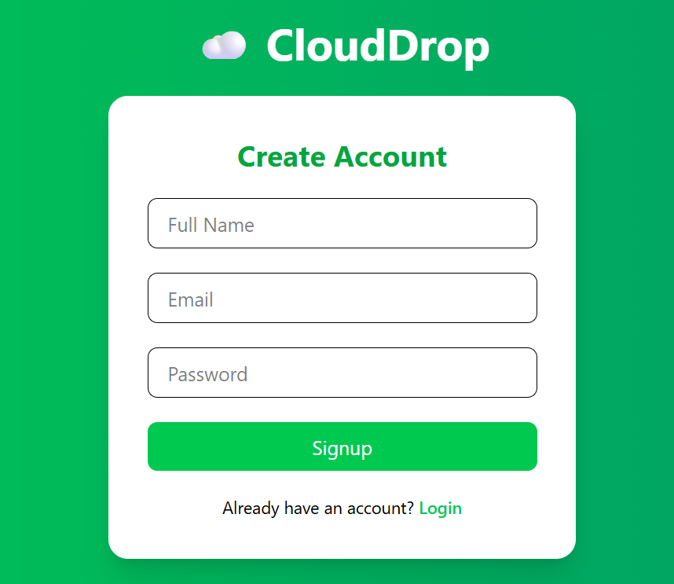

# 📦 CloudDrop – File Upload & Sharing Platform

  

  🚀 Cloud File Sharing Platform | MERN + AWS + Docker + CI/CD

---

## 🌐 Live Demo

👉 http://13.234.217.242:5173

---

## 📌 Features

### 👤 User Types

* **Guest Users**

  * Upload files without login
  * Get 6-digit unique access code
  * File expiry: 2 days
  * Max file size: **10MB**

* **Authenticated Users**

  * Login / Signup (JWT)
  * Upload & manage files
  * File expiry: 21 days
  * Dashboard access
  * Max file size: **100MB**

---

### 📂 File Handling

* Upload files using Multer
* Store files in AWS S3
* Generate pre-signed download URLs
* Access via unique 6-digit code
* Track **download count per file**
* Show **file type, size, upload date, expiry date**

---

### ⚡ Advanced Upload System

* Chunked file upload (S3 multipart upload)
* Resumable uploads (continue from last chunk)
* Upload progress bar (real-time)
* Automatic switch:
  * Small files → normal upload
  * Large files → chunked upload

---

### 📊 Dashboard & Analytics

* File list with structured table UI
* Upload date & expiry date display
* File status (Active / Expired)
* Download count tracking
* User profile sidebar:
  * Total files uploaded
  * Total storage used
  * Total downloads
  * Active vs expired files

---

### 🔐 Security & Logic

* JWT-based authentication
* Protected routes
* Industry-level validation:
  * Email format validation
  * Strong password rules
  * Name validation
* Backend file size validation (secure)
* Expiry-based file lifecycle
* Cron job for auto-deletion of expired files (MongoDB + S3)

---

### 🐳 DevOps & Deployment

* Dockerized frontend, backend, and MongoDB
* Docker Compose orchestration
* CI/CD pipeline using GitHub Actions
* Auto deployment to AWS EC2
* Dynamic Docker image tagging using commit SHA

---

## 🧱 Tech Stack

### 🔹 Frontend

* React.js
* Axios
* Tailwind CSS
* React Hot Toast

### 🔹 Backend

* Node.js
* Express.js
* MongoDB (Mongoose)
* Multer
* JSON Web Tokens (JWT)
* AWS SDK v3

### 🔹 Cloud

* AWS S3 (Multipart Upload)
* AWS EC2
* AWS IAM

### 🔹 DevOps

* Docker
* Docker Compose
* GitHub Actions (CI/CD)

---
## 📁 Project Structure

### Backend Structure
backend/
├── config/
│ ├── db.js # MongoDB connection
│ └── s3.js # AWS S3 configuration
├── controllers/
│ ├── authController.js # Authentication logic
│ └── fileController.js # File operations
├── middlewares/
│ ├── authMiddleware.js # JWT verification
│ ├── multer.middleware.js # File upload handling
│ └── errorMiddleware.js # Error handling
├── models/
│ ├── User.js # User schema
│ └── File.js # File schema
├── routes/
│ ├── authRoutes.js # Auth endpoints
│ └── fileRoutes.js # File endpoints
├── utils/
│ ├── asyncHandler.js # Async error wrapper
│ ├── ApiError.js # Custom error class
│ ├── ApiResponse.js # Standard response formatter
│ └── generateCode.js # 6-digit code generator
├── app.js # Express app setup
└── server.js # Server entry point

text

### Frontend Structure
frontend/
├── src/
│ ├── components/
│ │ ├── Upload.jsx # File upload with chunk support
│ │ ├── FileList.jsx # File management table
│ │ └── Sidebar.jsx # User profile & navigation
│ ├── pages/
│ │ ├── Landing.jsx # Homepage with guest/premium toggle
│ │ ├── Login.jsx # User login
│ │ └── Signup.jsx # User registration
│ ├── utils/
│ │ └── api.js # Axios configuration
│ ├── App.jsx # Routing & layout
│ └── main.jsx # Application entry
## 🚀 CI/CD Pipeline

Triggered on push to `main`.

### Steps:

1. Checkout code
2. Login to Docker Hub
3. Build Docker images
4. Push images with commit SHA
5. SSH into EC2
6. Pull latest images
7. Restart containers

---

## ☁️ Terraform Infrastructure

### Resources

* EC2 Instance
* Security Group
* S3 Bucket

### Commands
terraform init
terraform plan
terraform apply

---

## 🔄 System Flow

1. User uploads file (normal or chunked)
2. Backend validates file & user
3. File uploaded to S3 (simple or multipart)
4. Metadata stored in MongoDB
5. Unique 6-digit code generated
6. File accessed via code or dashboard
7. Download count tracked
8. Cron job deletes expired files

---

## 📊 Project Phases

| Phase                | Status |
| -------------------- | ------ |
| Core MERN App        | ✅      |
| AWS S3 Integration   | ✅      |
| Auth + Code + Expiry | ✅      |
| Cron Job             | ✅      |
| Advanced Upload      | ✅      |
| Docker               | ✅      |
| CI/CD                | ✅      |
| Terraform            | ❌      |

---

## 📸 Screenshots

### 🏠 Landing Page

### 🔐 Login

### 📊 Dashboard

### ⬆️ Upload

### 📂 Signup

---

## 🔥 Future Enhancements

* Nginx reverse proxy
* HTTPS (SSL)
* Custom domain
* IAM role-based AWS access

---

## 🔒 Security Improvements

* Use IAM roles instead of access keys
* Store secrets in environment variables
* Avoid hardcoding credentials

---

## 🧠 Key Learnings

* MERN stack development
* AWS S3 multipart upload
* Resumable file uploads
* Authentication systems
* CI/CD pipelines
* Docker containerization

---

## 👨‍💻 Author

**Balu Patil**